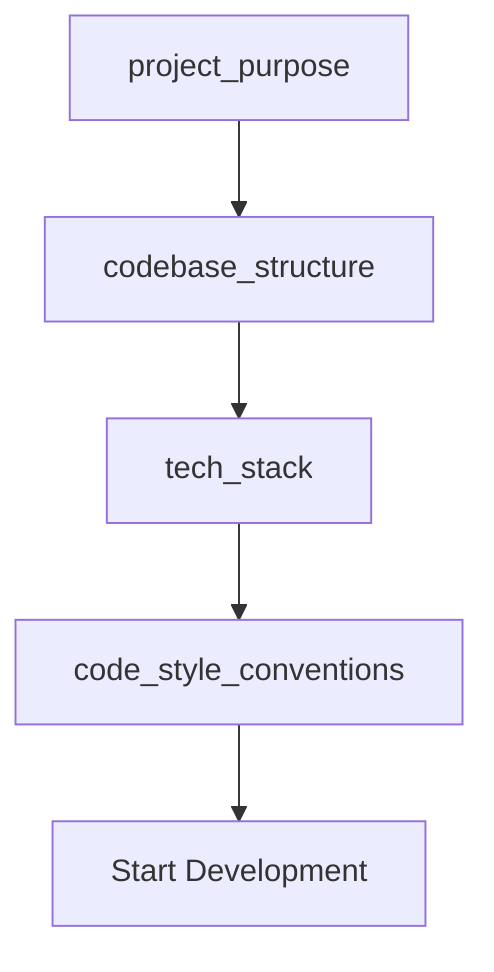
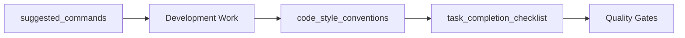
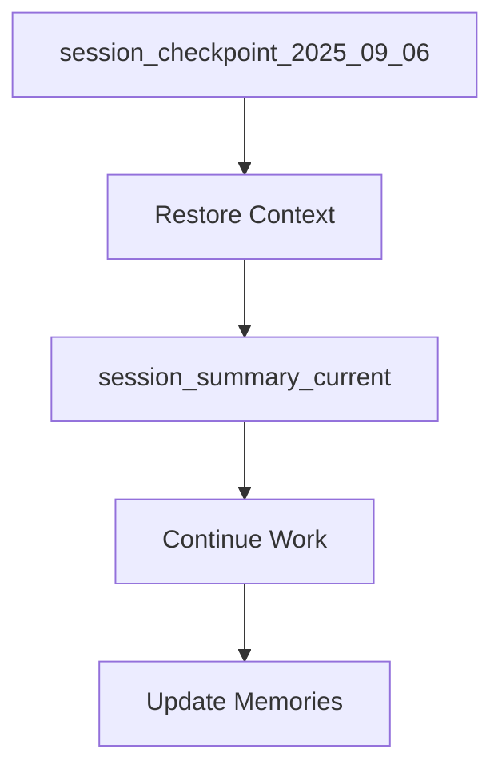

# 📚 MCP Shell Server - Memory Index & Navigation

## 🗂️ Memory Organization System

### 📋 Memory Categories

#### 🎯 **Project Core** (プロジェクト中核)
- [`project_purpose`] - プロジェクト目的と機能概要
- [`codebase_structure`] - コードベース構造とモジュール構成
- [`tech_stack`] - 技術スタックと依存関係

#### ⚙️ **Development Process** (開発プロセス)  
- [`code_style_conventions`] - コーディング規約とスタイル
- [`suggested_commands`] - 開発用コマンド一覧
- [`task_completion_checklist`] - タスク完了チェックリスト

#### 📊 **Session Management** (セッション管理)
- [`session_checkpoint_2025_09_06`] - セッションチェックポイント
- [`session_summary_current`] - 現在セッション要約

---

## 🔗 Cross-References & Relationships

### 🏗️ Architecture Flow
```
project_purpose ──→ codebase_structure ──→ tech_stack
                              ↓
                    code_style_conventions
```

### 🔄 Development Workflow
```
suggested_commands ──→ task_completion_checklist
         ↓                        ↓
code_style_conventions ←──── Quality Gates
```

### 📈 Session Continuity
```
session_checkpoint_2025_09_06 ──→ session_summary_current
                ↓
        [All Project Memories]
```

---

## 🎯 Quick Navigation

### 🚀 **新規開発者向け** (New Developers)
1. [`project_purpose`] - プロジェクト理解
2. [`codebase_structure`] - コード構造把握  
3. [`tech_stack`] - 技術環境確認
4. [`suggested_commands`] - 開発環境セットアップ

### 🔧 **開発作業時** (During Development)
1. [`code_style_conventions`] - コーディング規約確認
2. [`suggested_commands`] - 実行コマンド確認
3. [`task_completion_checklist`] - 品質確認

### 📊 **セッション管理** (Session Management)
1. [`session_checkpoint_2025_09_06`] - チェックポイント復元
2. [`session_summary_current`] - 現在状況確認

---

## 🔍 Memory Content Summary

### 🎯 Core Project Information
| Memory | Type | Key Content | Last Updated |
|--------|------|-------------|--------------|
| `project_purpose` | 🎯 Core | MCP Shell Server概要、セキュア実行 | Current |
| `codebase_structure` | 🏗️ Architecture | ディレクトリ構成、19テストファイル | Current |
| `tech_stack` | 🛠️ Technology | Python 3.11+, MCP, asyncio | Current |

### ⚙️ Development Process
| Memory | Type | Key Content | Usage Context |
|--------|------|-------------|---------------|
| `code_style_conventions` | 📋 Standards | black, ruff, mypy設定 | Coding |
| `suggested_commands` | ⚡ Commands | make test/check/format | Development |
| `task_completion_checklist` | ✅ QA | 品質確認、リリース前確認 | Task Completion |

### 📊 Session Context
| Memory | Type | Key Content | Purpose |
|--------|------|-------------|---------|
| `session_checkpoint_2025_09_06` | 💾 Checkpoint | セッション状態、復元情報 | Session Recovery |
| `session_summary_current` | 📄 Summary | 現セッション要約、継続性 | Context Understanding |

---

## 🎨 Usage Patterns

### 📖 **Read Sequence for New Tasks**


### 🔄 **Development Cycle Reference**


### 💾 **Session Continuity Flow**


---

## 🏷️ Memory Tags & Search

### 🔍 **Search Keywords**
- **Architecture**: `codebase_structure`, `tech_stack`
- **Quality**: `code_style_conventions`, `task_completion_checklist` 
- **Commands**: `suggested_commands`
- **Session**: `session_checkpoint_*`, `session_summary_*`
- **Purpose**: `project_purpose`

### 📊 **Content Categories**
- **Japanese Content**: `project_purpose`, `codebase_structure`, `code_style_conventions`
- **Mixed Content**: `suggested_commands`, `task_completion_checklist`, `tech_stack`
- **Session Data**: `session_checkpoint_*`, `session_summary_*`

---

## 🎛️ Maintenance Guidelines

### ✅ **Memory Health Indicators**
- ✅ **Fresh**: Recently updated, current information
- ⚠️ **Aging**: May need review and updates  
- 🔄 **Cyclical**: Regular update cycle (session memories)

### 🔄 **Update Responsibilities**
- **Project Core**: Update on major changes
- **Development Process**: Update on workflow changes
- **Session Management**: Automatic with `/sc:save`

### 🗑️ **Cleanup Criteria**
- Remove outdated session checkpoints (>7 days)
- Archive obsolete development patterns
- Consolidate duplicate information

---

**📝 Note**: This index serves as the central navigation hub for all project memories. Update this index when adding new memories or reorganizing existing ones.